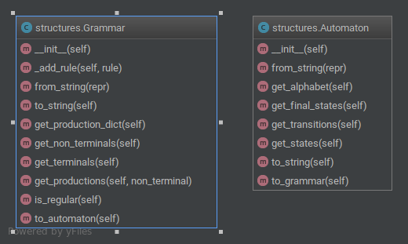

# Documentation
Command-line tool that recieves an Automaton or a Grammar


### AUTOMATON:
```
q0 q1 a
q0 q1 b
q1 q1 c
q1 q2 z
q0 q1 q2 
```
Pattern `start end symbol`

### GRAMMAR:
```
S -> aS | @ | cB
B -> b | c | bB
```

### CLI
```
[cat file.txt | ]./transformer.py --automaton/--grammar
```

## Diagram
